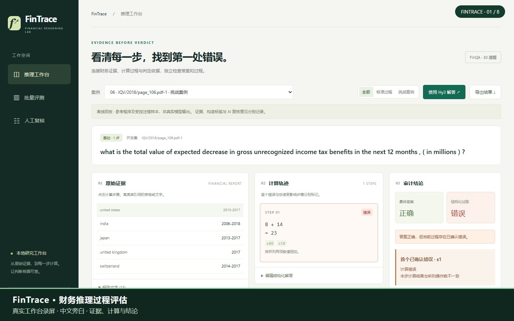

# FinTrace

**从财务证据追踪到每一步计算，定位首个已确认错误。**

基于 FinQA 的财务推理过程评估研究原型，支持离线案例、结构化过程核验、错误传播、批量统计和复核。已采集 **30 道题的真实 Hy3 解答与评审**，完成 90 个受控过程及 30 份真实解答的 AI 复核；**受控/重复评审仍有 44 项因 HTTP 402 失败**。

本项目为个人研究/活动作品，并非腾讯或 FinQA 团队官方产品。

**评审入口：[项目提交说明](docs/SUBMISSION.md) · [实验报告](runs/experiments/batch-v1/REPORT.md) · [独立评测审计](runs/ai_review/evaluation_audit/REPORT.md)**

**[▶ 观看演示视频（1 分 56 秒，中文旁白）](demo/fintrace-demo.mp4)** · [字幕与旁白稿](demo/README.md)

## 本地启动

需要 Python 3.11 或更新版本。核心程序和页面不需要安装第三方依赖。在本仓库目录运行：

    python scripts/serve_batch_workbench.py

浏览器打开 **http://127.0.0.1:8765**。Windows 也可双击“启动工作台.cmd”，随后打开上述地址。

若终端使用非 UTF-8 编码，命令中的 `python` 可替换为 `python -X utf8`；Windows 启动脚本与 GitHub 自动测试已配置 UTF-8。

- **推理工作台**：原始表格/文字、证据高亮、计算轨迹、首错及判定依据；支持编辑 JSON 重评和导出。
- **批量评测**：读取实际保存的离线运行结果，显示分子、分母、错误类型和待完成实验。
- **人工复核**：匿名案例；提交初始判断前隐藏评估器结果，提交后保留不可覆盖的初始记录。

默认案例将 8 + 14 写成 23，最终答案却仍为正确的 22。系统分别报告“答案正确”和“过程错误”。页面明确区分离线案例与真实调用。

## 已运行的验证

- 最新 [批量实验报告](runs/experiments/batch-v1/REPORT.md)：30 题生成与评审成功；受控语义评审 69/90，额外重复评审 1/24。全部失败保留，未用模拟结果替代。
- 真实答案与原始 FinQA 程序符合 **20/30**；AI 另认为 **28/30** 答案有题面支持、2/30 范围未定。这是两种不同口径，不能把 AI 复核当人工准确率。
- [独立 AI 复核](runs/ai_review/independent_review/REPORT.md) 对 8 道参考题提出争议，其中包含年份错配、增长方向颠倒；原始标签与分歧完整保留。
- [独立 AI 评测审计](runs/ai_review/evaluation_audit/REPORT.md) 发现并验证修复 3 项问题；项目 36 项测试通过，最终统计由另一套计数逻辑复核。

- 30 道真实 FinQA 题目，难度按参考步数 1/2/3+ 各 10 道；10 道开发题、20 道评测题，按报告隔离。
- 30 个参考正确过程、60 个受控错误过程，含局部计算成立的公式挑战。
- 官方 FinQA 计算器与本项目执行器交叉核验：**30/30 一致**。
- 当前规则对构造集确认 **45/60** 个错误，另 **15/60** 个公式挑战返回无法确定；参考正确过程误报 **0/30**。
- 评测集的错误检出/首错定位为 **31/40**，参考正确过程误报 **0/20**。

以上标签由参考程序转换和受控构造得到，已提供独立 AI 语义复核记录；这些数字不能代表独立人工金标下的准确率，也不能代表 Hy3 能力。公式不同并不自动构成错误，因此规则允许弃权。详见 [离线报告](runs/offline/REPORT.md) 和 [逐题结果](runs/offline/results.json)。

## 常用命令

运行离线功能与 API 测试，不调用真实模型：

    python -m unittest discover -s tests -v

重算 90 个受控样本，生成 JSON / CSV / Markdown：

    python -m fintrace benchmark

单独运行评测划分：

    python -m fintrace benchmark --split test --out runs/test

检查接口是否已配置，不显示密钥：

    python -m fintrace status

## 配置 Hy3

复制 .env.example 为 .env，在本地填写：

    HY3_API_KEY=填写本地密钥
    HY3_BASE_URL=填写服务商提供的基础地址
    HY3_MODEL=填写获准使用的模型名称
    HY3_TIMEOUT=180
    HY3_MAX_TOKENS=8192

适配器使用 HTTPS 基础地址下的 /chat/completions 协议。基础地址不要重复包含该路径；实际地址、模型名与权限以你的 Hy3 服务为准。当前已通过真实端点的一题验证；更换配置后应重新测试。密钥只从环境变量或本地 .env 读取，不进入前端、版本库或请求记录。

首次真实调用一题：

    python -m fintrace live --limit 1 --out runs/live/smoke

开发集生成与语义评审：

    python -m fintrace live --split dev --limit 10 --judge --out runs/live/dev-v1

冻结配置后评测剩余 20 题：

    python -m fintrace live --split test --limit 20 --judge --out runs/live/test-v1

三组对照中的规则组已可离线运行；以下两组需要真实接口：

    python -m fintrace benchmark --mode judge --out runs/live/judge-v1
    python -m fintrace benchmark --mode hybrid --out runs/live/hybrid-v1

续跑时保持相同参数并添加 --resume；数据、提示词、模型或代码变化时使用新目录。原始响应、失败和每次尝试分别保存，失败不会用模拟解答替代。

## 数据复现

仓库已经包含可离线使用的 30 题子集与 90 个过程，不必下载全量数据。如需从原始数据重建：

    python scripts/download_finqa.py
    python -m fintrace build-data
    python scripts/verify_official.py
    python -m fintrace benchmark

上游固定提交为 0f16e2867befa6840783e58be38c9efb9229d742，来源 URL、文件哈希、排除统计见 [数据清单](data/manifest.json)。全量缓存约 78MB，不纳入版本库。FinQA 原始许可保存在 [FinQA-LICENSE.txt](data/source/FinQA-LICENSE.txt)。

## 项目结构

    fintrace/       数据转换、执行器、评估器、Hy3、实验入口和本地网页
    data/           固定题集、受控过程、来源与许可
    tests/          算术、等价解法、传播、指标、协议与本地 API 测试
    scripts/        数据下载与官方执行器交叉核验
    runs/offline/   实际生成的离线逐题结果与报告
    docs/           方法、实现状态、原始方案和演示流程

阅读 [方法与评价口径](docs/METHOD.md)、[实现状态与待完成项](docs/IMPLEMENTATION_STATUS.md)、[原始方案](docs/PROPOSAL.md)、[演示流程](docs/DEMO.md)。

## 当前限制

1. 规则证明范围是结构化证据与四则计算，不是任意自然语言财务推导；不同公式无法证明等价时保留无法确定。
2. 自动证据对齐、构造标签与 AI 复核意见分别保存，保留争议和对应评价口径。
3. 子集偏向四则运算和易对齐证据，不代表整个 FinQA；目前四种主注错标签不覆盖全部财务语义错误。
4. 真实实验部分完成；受控评审 21 项、额外重复评审 23 项因 HTTP 402 失败，稳定性暂不能判断。
5. 网页仅绑定本机地址，是本地研究工具，未做公网部署。

项目代码采用 MIT；FinQA 数据与上游代码保留其原始 MIT 许可和出处。

## 本轮复现与续跑

实验协议、三种标签口径和已知精度边界见 [BATCH_PROTOCOL.md](docs/BATCH_PROTOCOL.md)。恢复接口计费/额度后，仅续跑失败作业：

    python scripts/run_batch.py --out runs/live/batch-v1 --resume --workers 1
    python scripts/report_batch.py

续跑需要保持本轮冻结的数据、提示词和核心代码不变；已经成功的作业直接读取。报告与网页展示可独立更新。原始凭据不纳入仓库，也无需发到聊天中。
